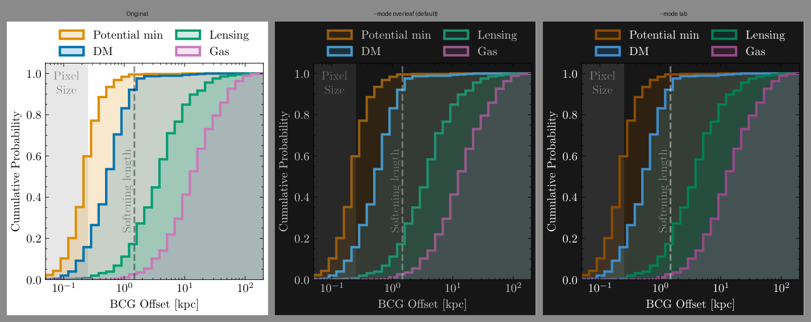

# figinvert

[](https://github.com/CianMRoche/figinvert/actions/workflows/ci.yml)
[](LICENSE)

Command line tool to make dark-background versions of figures in PDF, SVG, PNG/JPG. PDFs and SVGs stay vectors.

If you still have the code to regenerate the figure, re-rendering with a dark style is still prefereable. This is for figures whose source you no longer have, or if youre feeling a little lazy :)



<sub>Example figure from Roche et al. (2024), *Brightest Cluster Galaxy Offsets
in Cold Dark Matter*, The Open Journal of Astrophysics
([arXiv:2402.00928](https://arxiv.org/abs/2402.00928)).</sub>

## Install

Requires [uv](https://docs.astral.sh/uv/getting-started/installation/).

```bash
uv tool install git+https://github.com/CianMRoche/figinvert
```

You may need to add the uv tools directory to your PATH variable, which can be done easily with:

```bash
uv tool update-shell
```

To update to the latest version in future:

```bash
uv tool upgrade figinvert
```

If that reports nothing to upgrade but you're out of date, the version number may not have changed, so you can force the update with:

```bash
uv tool install --force --reinstall git+https://github.com/CianMRoche/figinvert
```

## Use

```bash
figinvert fig.pdf              # -> fig_dark.pdf
figinvert fig.pdf -m lab       # punchier
figinvert *.png -t             # transparent background
figinvert fig.svg -o out.svg
```

## Modes

| mode | white → | black → | |
|---|---|---|---|
| `overleaf` *(default)* | `#171717` | `#d1d1d1` | approximates the Overleaf PDF inversion |
| `lab` | `#171717` | `#ffffff` | flips CIELAB lightness, keeps hue and chroma, more contrast/saturation |
| `naive` | `#000000` | `#ffffff` | plain `255-x`; destroys hue, for comparison |

## Options

| flag | |
|---|---|
| `-m, --mode` | `overleaf` (default), `lab`, `naive` |
| `-t, --transparent` | drop the background instead of darkening it |
| `-o, --output` | output path (single input only) |
| `--suffix` | rename suffix, default `_dark` |
| `--overwrite` | edit in place |
| `--chroma` | saturation multiplier for `lab`, e.g. `1.25` |
| `--range LO HI` | `lab` output L\* range, default `7.74 100` |
| `--bg-method` | raster transparency: `unmix` (default) or `key` |
| `--no-image-recolour` | leave rasters embedded in a PDF untouched |

**`--transparent`**
PDF/SVG: a white shape covering ≥95% of the page is
dropped. 
Raster graphics: `unmix` (default) best for lines and text but solid light fills go partly transparent;
try `key` for bar charts and filled regions.


## Development

```bash
git clone https://github.com/CianMRoche/figinvert
cd figinvert
uv sync --group dev
uv run pytest -q
```

Regenerate the examples and comparison strip
with `uv run --group dev python examples/make_examples.py`.

```
src/figinvert/
  colour.py   colour transforms + fitted constants
  pdf.py      vector PDF backend (pikepdf content-stream rewriting)
  svg.py      SVG backend (lxml attribute/CSS rewriting)
  raster.py   PNG/JPEG backend (Pillow)
  cli.py      argument parsing and dispatch
```


## Limitations

- PDF shadings and pattern / `Separation` colour spaces are left untouched.
- Background removal is a bit clunky, doesnt work for inverting from dark to light for exaple. 
- `overleaf` mode is approximate for saturated colours.
- CMYK goes through RGB, so exact CMYK is not preserved.

## Licence

MIT — see [LICENSE](LICENSE).
